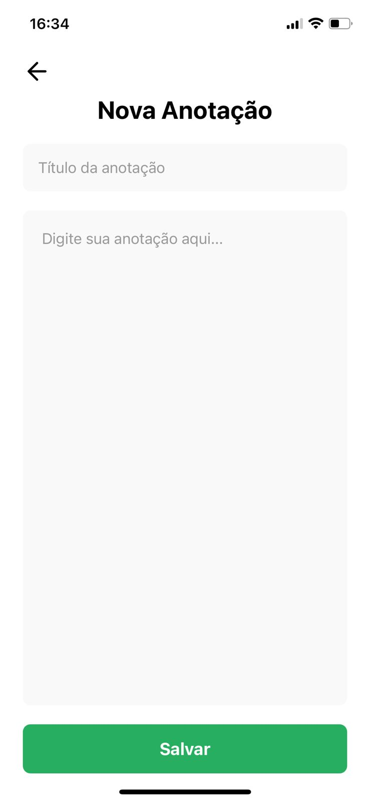
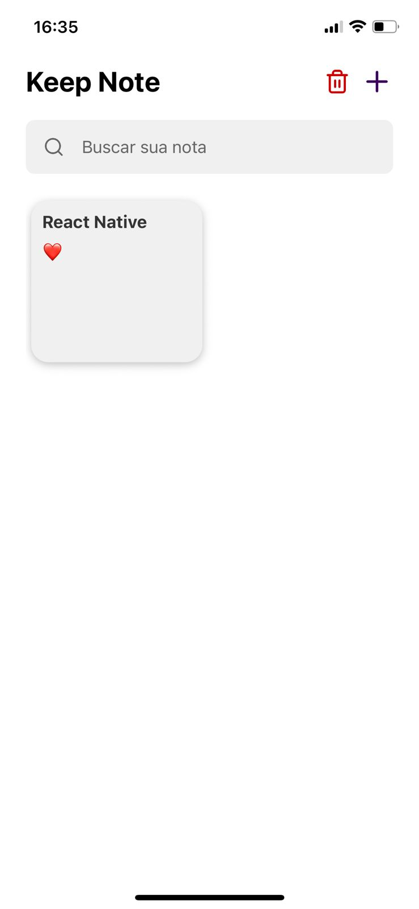
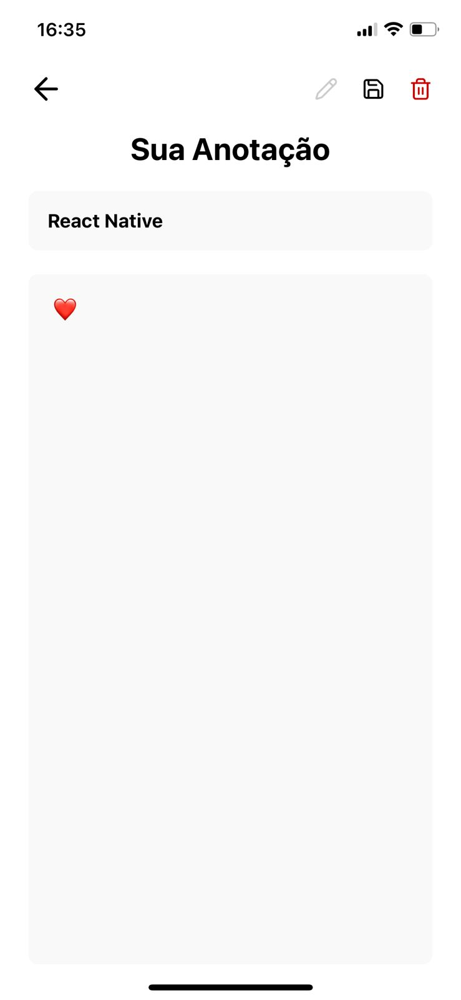

# Keep Note

Keep Note é um aplicativo de anotações desenvolvido para proporcionar uma maneira simples e prática de criar, editar e gerenciar suas notas diretamente do seu dispositivo móvel.

## ✨ Visão Geral

O objetivo deste projeto é oferecer uma solução intuitiva para o registro rápido de informações importantes, ideias e tarefas do dia a dia. Desenvolvido como parte do meu processo de aprendizado em desenvolvimento mobile.

## ⚙️ Tecnologias Utilizadas

- **Expo** — O aplicativo foi desenvolvido utilizando Expo, facilitando o desenvolvimento, build e publicação em React Native.
- **React Native** — Framework para desenvolvimento de aplicativos mobile multiplataforma.
- **TypeScript** — Superset do JavaScript que adiciona tipagem estática ao código, proporcionando maior segurança e produtividade.
- **AsyncStorage** — Utilizado para o armazenamento local das anotações, garantindo que suas notas estejam sempre acessíveis, mesmo offline.

## 🖼️ Screenshots

Veja abaixo algumas telas do app:

<div style="display: flex; gap: 10px;">
  
  
  
  
</div>

## 📝 Funcionalidades

- **Criar Anotações**: Registre rapidamente novas ideias ou informações.
- **Editar Notas**: Modifique facilmente o conteúdo das suas anotações.
- **Salvar Notas**: Suas notas são armazenadas localmente, mantendo a privacidade e o acesso offline.
- **Excluir Notas**: Remova anotações que não são mais necessárias.

## 🚀 Motivação

Este app foi desenvolvido como parte do meu aprendizado em React Native, TypeScript e no gerenciamento de dados locais utilizando AsyncStorage. O projeto serviu como um laboratório prático para consolidar esses conhecimentos.

## 📱 Como Executar

1. Clone este repositório:
   ```bash
   git clone https://github.com/dev-raullopes/keep-note.git
   ```
2. Instale as dependências:
   ```bash
   npm install
   # ou
   yarn install
   ```
3. Execute o projeto:
   ```bash
   npx expo start
   ```

## 🧑‍💻 Autor

Desenvolvido por [Raul Lopes](https://github.com/dev-raullopes)

---

Sinta-se à vontade para abrir issues ou sugerir melhorias!
